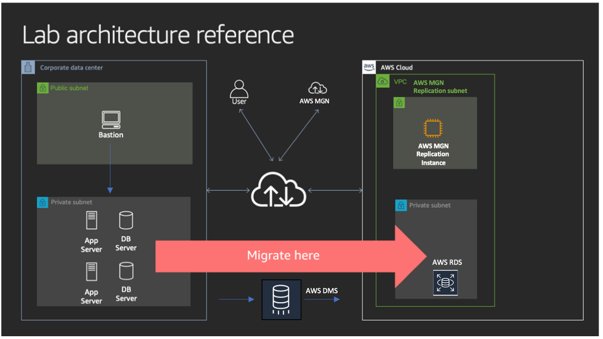

### Migrating application using Migration Hub 
In this workshop we will perform discovery and migration of an emulated production environment running on a customer datacenter. The environment consists of 2 applications and 4 servers.
All the concepts applied in this migration exercise can also be applied to 10s, 100s or 1000s of server migrations.

For detail, access [here](https://tonychanhnguyen.github.io/MigratingApplicationUsingMigrationHub/)

